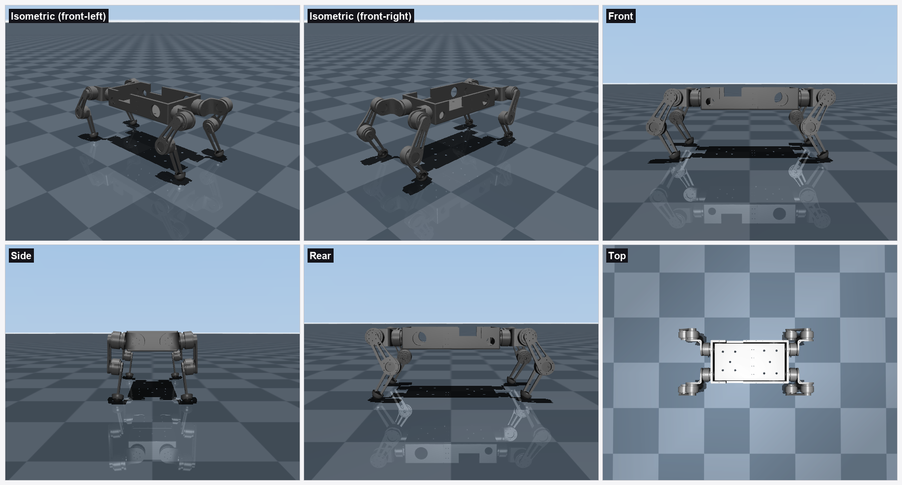
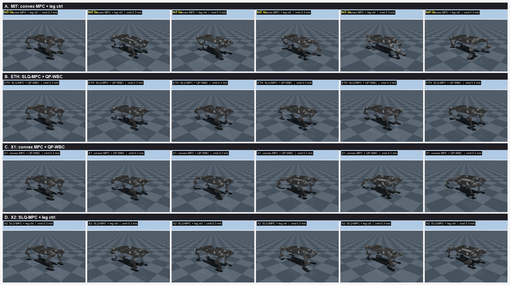

# DOG4.6_description — new Fusion-exported quadruped benchmark package

Self-contained sibling of `DOG3.0_description` with identical functionality, but the
platform is the new Fusion 360 "DOG" robot: **7.334 kg, MG5010-i10 actuators,
tau_max = ±7 N·m, rotor armature 8.5e-3 kg·m²** (measured, reflected through 10:1).

## Simulation environment

The MuJoCo scene (`scene\DOG4.6_scene.xml`) places the robot on a flat checkerboard
floor and drives it at a commanded body velocity. The standing robot from six camera
angles in MuJoCo:



All four controller stacks trotting at the same command (0.3 m/s). Each row is one
stack; six successive frames per stack, ordered left-to-right then top-to-bottom:



```
scene\DOG4.6_scene.xml     simulation scene (joint1..12 / m1..12 / {leg}_foot sites —
                           same naming contract as DOG3.0, srb_mpc runs unchanged)
scene\build_dog_scene.py   scene generator (single source of truth; SPLAY/TAU/limits here)
scene\smoke_dog.py         quick stand + trot check for all 4 stacks
scene\run_benchmark.py     detached sequential benchmark runner
srb_mpc\                   controller stacks (copied verbatim from DOG3.0_description)
tests\compare_stacks.py    benchmark harness (paths point at this package)
meshes\dog_*.stl           29 visual meshes (mm, x0.001)
urdf\                      Fusion export artifacts: dog.urdf, dog.xml (standalone MJCF),
                           build_urdf.py / build_mjcf.py, mesh_transforms.json
results\                   7 N·m platform benchmark results + analysis
```

Usage (same as DOG3.0):
```
D:\mujoco\.venv\Scripts\python -u tests\compare_stacks.py run {mit,eth,cvxwbc,slqjt} {s1s2,s5}
D:\mujoco\.venv\Scripts\python    tests\compare_stacks.py report
```

Key results (vs DOG3.0, see `results\dog7nm_platform_analysis.md`):
- X2 (SLQ + leg) remains the best locomotion stack: only stack that both tracks velocity
  and ties the 0.65 m/s ceiling.
- Attribution flips with torque margin: tight torque -> high level (SLQ) owns the speed
  ceiling, WBC owns push recovery; rich torque (DOG3.0) -> low level owned the ceiling.

Notes:
- Stand keyframe bakes 0.10 rad outward splay (required: feet-under-hips rolls over).
- qp_wbc still plans with its internal tau_max=18 (code kept byte-identical to DOG3.0);
  MuJoCo clamps to ±7. See analysis caveat #1.
